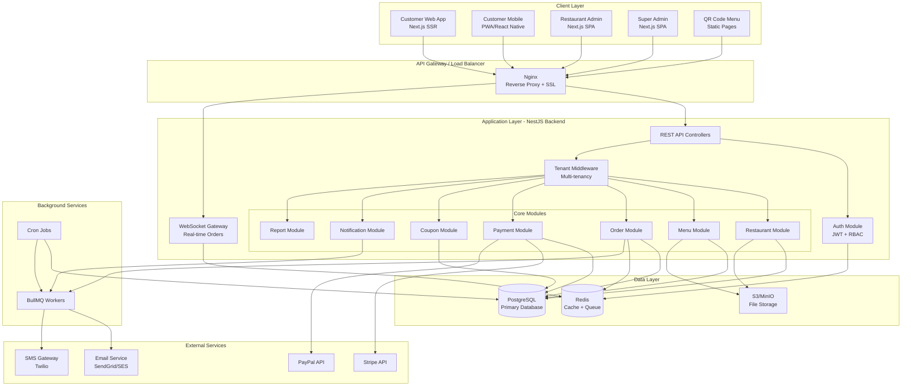
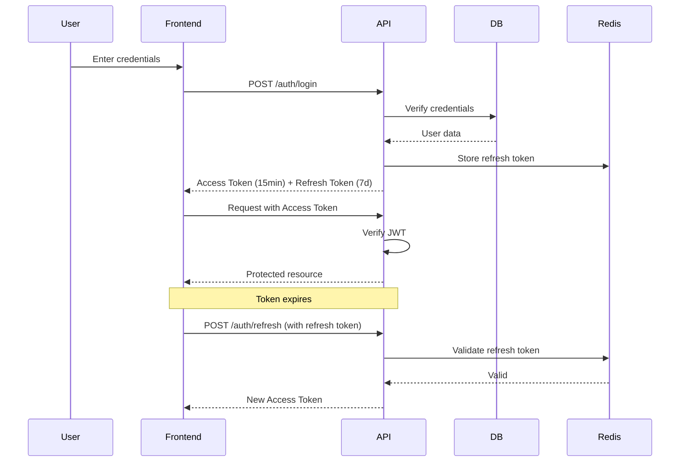
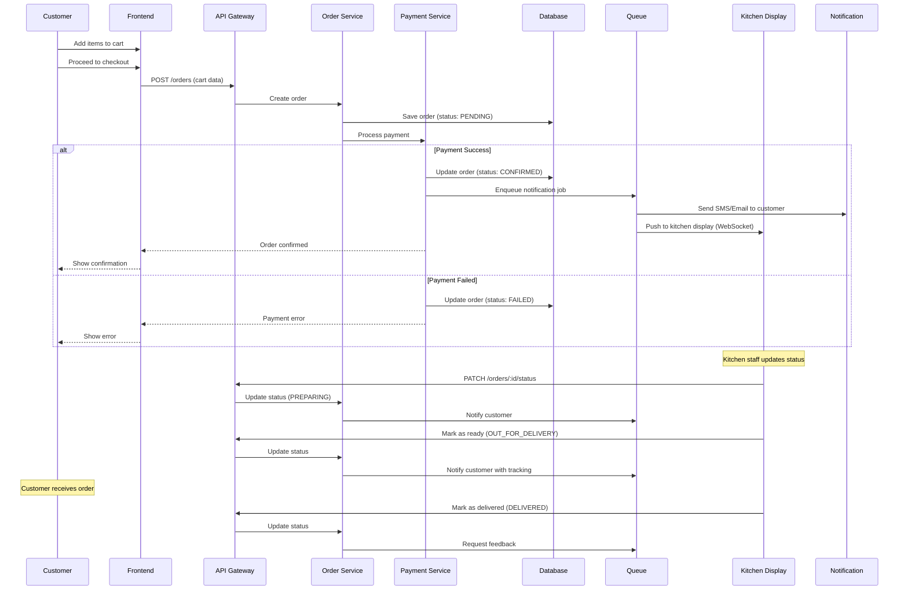

# Restaurant Online Ordering SaaS - System Architecture

## Table of Contents
1. [Executive Summary](#executive-summary)
2. [Technology Stack Recommendation](#technology-stack-recommendation)
3. [Architecture Pattern](#architecture-pattern)
4. [High-Level System Diagram](#high-level-system-diagram)
5. [Multi-Tenancy Strategy](#multi-tenancy-strategy)
6. [Security Architecture](#security-architecture)
7. [Scalability Roadmap](#scalability-roadmap)
8. [Infrastructure Components](#infrastructure-components)

---

## 1. Executive Summary

This document outlines the complete architecture for a **Multi-Tenant SaaS Online Ordering Platform** designed for restaurants. The system supports:

- **Multi-restaurant management** with branch support
- **Real-time order processing** and tracking
- **Payment processing** (Stripe, PayPal, Cash)
- **Multi-language** (English, Arabic) and multi-currency
- **QR code menu** generation
- **Customer mobile/web interface**
- **Super Admin platform management**
- **Restaurant admin dashboards**
- **Delivery zone management**
- **Coupon and promotion system**

---

## 2. Technology Stack Recommendation

### Backend
- **Runtime**: Node.js v20+ (TypeScript)
- **Framework**: NestJS (modular, scalable, enterprise-ready)
- **API Style**: RESTful + WebSocket (real-time orders)
- **ORM**: Prisma (type-safe, migration support)
- **Validation**: class-validator, class-transformer
- **Authentication**: JWT + Passport.js
- **File Storage**: AWS S3 / MinIO (local dev)

### Database
- **Primary DB**: PostgreSQL 15+ (multi-tenant support, JSONB, robust)
- **Cache Layer**: Redis 7+ (sessions, rate limiting, real-time data)
- **Search Engine**: PostgreSQL Full-Text Search (or Elasticsearch for scale)

### Frontend - Admin Panels
- **Framework**: Next.js 14+ (App Router)
- **Language**: TypeScript
- **UI Library**: React 18+
- **Component Library**: Tailwind CSS + shadcn/ui
- **State Management**: Zustand / TanStack Query
- **Forms**: React Hook Form + Zod
- **Charts**: Recharts / Chart.js
- **i18n**: next-intl

### Frontend - Customer App
- **Framework**: Next.js 14+ (SSR/SSG for SEO)
- **PWA**: next-pwa (installable web app)
- **Maps**: Leaflet / Google Maps API
- **QR Code**: qrcode.react

### Background Jobs
- **Queue**: BullMQ (Redis-based)
- **Scheduler**: node-cron
- **Use Cases**:
  - Email notifications
  - Order reminders
  - Report generation
  - Webhook retries

### Payment Integration
- **Stripe**: @stripe/stripe-js
- **PayPal**: @paypal/checkout-server-sdk
- **Cash**: Manual confirmation flow

### DevOps & Infrastructure
- **Containerization**: Docker + Docker Compose
- **Reverse Proxy**: Nginx
- **SSL**: Let's Encrypt (Certbot)
- **CI/CD**: GitHub Actions
- **Monitoring**: Prometheus + Grafana (optional)
- **Logging**: Winston + LogTail / Sentry
- **Hosting**: AWS / DigitalOcean / Railway

### Testing
- **Unit**: Jest + Testing Library
- **E2E**: Playwright
- **API**: Supertest

---

## 3. Architecture Pattern

### Chosen Pattern: **Modular Monolith** (with Microservices-Ready Structure)

**Why Modular Monolith?**

✅ **Faster Initial Development**: Single codebase, easier debugging
✅ **Lower Infrastructure Costs**: One deployment, shared resources
✅ **Simpler Deployment**: No service orchestration complexity
✅ **Easy Refactoring**: Can split into microservices later
✅ **Transactional Integrity**: ACID guarantees across modules

**Migration Path to Microservices**:
When scale demands, split modules into services:
- Auth Service
- Restaurant Service
- Order Service
- Payment Service
- Notification Service

---

## 4. High-Level System Diagram



---

## 5. Multi-Tenancy Strategy

### Chosen Approach: **Single Database with Tenant Isolation (tenant_id)**

#### Schema Design Pattern:
```sql
-- Every tenant-specific table includes tenant_id
CREATE TABLE restaurants (
    id UUID PRIMARY KEY,
    tenant_id UUID NOT NULL REFERENCES tenants(id),
    name VARCHAR(255) NOT NULL,
    -- other fields
    created_at TIMESTAMP DEFAULT NOW()
);

CREATE INDEX idx_restaurants_tenant ON restaurants(tenant_id);

-- Row-Level Security (Optional but Recommended)
ALTER TABLE restaurants ENABLE ROW LEVEL SECURITY;

CREATE POLICY tenant_isolation_policy ON restaurants
    USING (tenant_id = current_setting('app.current_tenant')::UUID);
```

#### Tenant Middleware Flow:
```
1. Request arrives → Extract tenant from subdomain/header
2. Validate tenant exists and is active
3. Set tenant context in request scope
4. All queries auto-filter by tenant_id
5. Response sent
```

#### Benefits:
✅ **Cost Effective**: Single DB, shared resources
✅ **Easy Backups**: One database to backup
✅ **Simpler Migrations**: Apply once
✅ **Cross-Tenant Reporting**: Super admin analytics

#### Security Measures:
- Middleware enforces tenant_id on ALL queries
- Database row-level security as backup
- API keys/JWT include tenant context
- Audit logs track all tenant access

---

## 6. Security Architecture

### 6.1 Authentication Flow



### 6.2 Authorization (RBAC)

**Roles Hierarchy**:
```
1. SUPER_ADMIN (Platform owner)
   - Manage all tenants
   - Billing & subscriptions
   - System settings

2. RESTAURANT_ADMIN (Restaurant owner)
   - Manage restaurant settings
   - Manage branches
   - Manage staff
   - View all reports

3. BRANCH_MANAGER
   - Manage branch menu
   - Manage branch orders
   - View branch reports

4. CASHIER
   - View orders
   - Update order status
   - Process payments

5. CUSTOMER
   - Place orders
   - View order history
```

**Permission Check**:
```typescript
@UseGuards(JwtAuthGuard, RolesGuard)
@Roles(Role.RESTAURANT_ADMIN, Role.BRANCH_MANAGER)
@Put('/menu/items/:id')
async updateMenuItem() { }
```

### 6.3 Security Checklist

- [x] **Input Validation**: class-validator on all DTOs
- [x] **SQL Injection**: Prisma ORM (parameterized queries)
- [x] **XSS Protection**: Helmet.js, CSP headers
- [x] **CSRF**: SameSite cookies, CSRF tokens
- [x] **Rate Limiting**: Redis-based (100 req/min per IP)
- [x] **Password Hashing**: bcrypt (12 rounds)
- [x] **JWT Secret Rotation**: Environment-based secrets
- [x] **HTTPS Only**: Enforce SSL, HSTS headers
- [x] **CORS**: Whitelist specific origins
- [x] **Dependency Scanning**: Snyk / npm audit
- [x] **Sensitive Data**: Encrypt PII at rest
- [x] **Audit Logging**: Log all auth events
- [x] **File Upload**: Validate types, scan for malware
- [x] **API Versioning**: /api/v1/...
- [x] **Environment Secrets**: Never commit .env

---

## 7. Scalability Roadmap

### Phase 1: MVP (0-1,000 restaurants)
- **Architecture**: Modular Monolith
- **Database**: Single PostgreSQL instance
- **Hosting**: Single VPS (4 CPU, 8GB RAM)
- **Load**: ~10,000 orders/day
- **Cost**: ~$50/month

### Phase 2: Growth (1,000-10,000 restaurants)
- **Database**: PostgreSQL with read replicas
- **Cache**: Redis cluster
- **Hosting**: 2-3 load-balanced app servers
- **CDN**: CloudFlare for static assets
- **Load**: ~100,000 orders/day
- **Cost**: ~$500/month

### Phase 3: Scale (10,000+ restaurants)
- **Architecture**: Migrate to microservices
- **Database**: Sharded PostgreSQL or CockroachDB
- **Queue**: Separate queue cluster
- **Hosting**: Kubernetes (EKS/GKE)
- **Monitoring**: Datadog / New Relic
- **Load**: 1M+ orders/day
- **Cost**: ~$5,000/month

### Horizontal Scaling Triggers:
- **CPU > 70%** for 5 minutes → Add app server
- **DB Connections > 80%** → Add read replica
- **Queue depth > 1000** → Add worker nodes
- **Response time > 500ms** → Investigate/scale

---

## 8. Infrastructure Components

### 8.1 Development Environment
```yaml
# docker-compose.yml
services:
  app:
    build: ./backend
    ports: ["3000:3000"]
    env_file: .env
    depends_on: [postgres, redis]

  postgres:
    image: postgres:15-alpine
    environment:
      POSTGRES_DB: restaurant_saas
      POSTGRES_PASSWORD: dev_password
    volumes:
      - pg_data:/var/lib/postgresql/data

  redis:
    image: redis:7-alpine
    ports: ["6379:6379"]

  minio:
    image: minio/minio
    ports: ["9000:9000", "9001:9001"]
    environment:
      MINIO_ROOT_USER: minioadmin
      MINIO_ROOT_PASSWORD: minioadmin
    command: server /data --console-address ":9001"
```

### 8.2 Production Stack
```
[Internet]
    |
[CloudFlare CDN] ← Static assets, DDoS protection
    |
[Load Balancer / Nginx]
    |
    ├── [App Server 1] ← NestJS
    ├── [App Server 2] ← NestJS
    └── [App Server N] ← NestJS
         |
         ├── [PostgreSQL Primary] → [Replica 1, Replica 2]
         ├── [Redis Cluster]
         └── [S3 Bucket]
```

### 8.3 Monitoring & Observability
```
Application Metrics:
  - Request/sec
  - Response time (p50, p95, p99)
  - Error rate
  - Active orders
  - Payment success rate

Business Metrics:
  - New signups/day
  - Active restaurants
  - Total orders
  - Revenue (MRR, ARR)
  - Churn rate

Infrastructure:
  - CPU, Memory, Disk usage
  - Database query performance
  - Queue length
  - Cache hit rate
```

---

## 9. System Data Flow - Order Lifecycle



---

## 10. API Structure Overview

```
/api/v1
├── /auth
│   ├── POST /register
│   ├── POST /login
│   ├── POST /refresh
│   └── POST /logout
├── /tenants (Super Admin only)
│   ├── GET /
│   ├── POST /
│   └── PATCH /:id
├── /restaurants
│   ├── GET /
│   ├── POST /
│   ├── GET /:id
│   └── PATCH /:id
├── /branches
│   ├── GET /
│   ├── POST /
│   └── PATCH /:id
├── /menu
│   ├── /categories
│   ├── /items
│   ├── /modifiers
│   └── /availability
├── /orders
│   ├── POST /
│   ├── GET /
│   ├── GET /:id
│   ├── PATCH /:id/status
│   └── POST /:id/cancel
├── /coupons
│   ├── GET /
│   ├── POST /
│   └── POST /validate
├── /payments
│   ├── POST /stripe/create-intent
│   ├── POST /stripe/webhook
│   ├── POST /paypal/create-order
│   └── POST /paypal/capture
├── /customers
│   ├── GET /me
│   ├── PATCH /me
│   └── GET /orders
├── /reports
│   ├── GET /sales
│   ├── GET /popular-items
│   └── GET /revenue
└── /webhooks
    ├── POST /stripe
    └── POST /paypal
```

---

## 11. Non-Functional Requirements

### Performance Targets
- **API Response Time**: < 200ms (p95)
- **Page Load**: < 2s (LCP)
- **Database Query**: < 50ms average
- **Order Placement**: < 3s end-to-end
- **WebSocket Latency**: < 100ms

### Availability
- **Uptime SLA**: 99.9% (43 minutes downtime/month)
- **Deployment Strategy**: Blue-green or rolling updates
- **Database Backups**: Daily automated + WAL archiving
- **Disaster Recovery**: RTO < 4 hours, RPO < 1 hour

### Compliance
- **GDPR**: Right to erasure, data export
- **PCI DSS**: No card data storage (use Stripe/PayPal tokens)
- **Accessibility**: WCAG 2.1 AA compliance
- **Privacy**: Cookie consent, privacy policy

---

## Summary

This architecture provides:

✅ **Scalable Foundation**: Start simple, grow to microservices
✅ **Cost Effective**: Optimize for early-stage SaaS
✅ **Secure by Default**: Industry best practices
✅ **Developer Friendly**: TypeScript, modern tooling
✅ **Production Ready**: Docker, CI/CD, monitoring

**Next Steps**: Database schema design and API specification.
