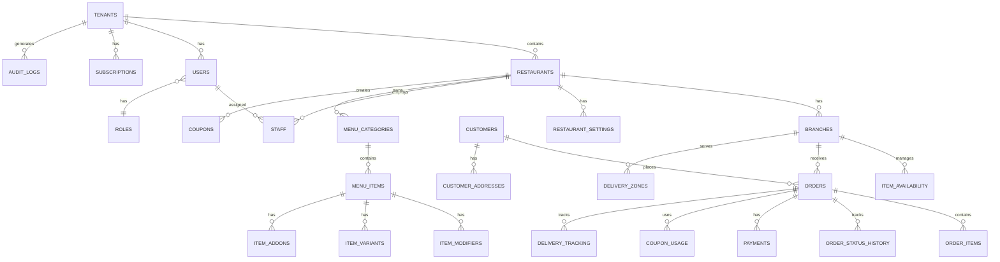

# Restaurant SaaS - Database Schema Design

## Table of Contents
1. [Overview](#overview)
2. [Entity Relationship Diagram](#entity-relationship-diagram)
3. [Multi-Tenant Design](#multi-tenant-design)
4. [Table Specifications](#table-specifications)
5. [Indexes Strategy](#indexes-strategy)
6. [Prisma Schema](#prisma-schema)
7. [SQL Migrations](#sql-migrations)
8. [Data Audit & Compliance](#data-audit--compliance)

---

## 1. Overview

### Database: PostgreSQL 15+

**Key Features Used**:
- UUID for primary keys (distributed, collision-resistant)
- JSONB for flexible data (menu options, metadata)
- Full-text search for menu items
- Row-level security for tenant isolation
- Triggers for audit logging
- Partial indexes for performance

### Database Structure:
- **27 Main Tables**
- **Multi-tenant architecture** (tenant_id on all tenant-specific tables)
- **Soft deletes** (deleted_at timestamp)
- **Audit trails** (created_at, updated_at, created_by, updated_by)

---

## 2. Entity Relationship Diagram



### Detailed ERD with Relationships

```
┌─────────────┐
│  TENANTS    │
│ (Platform)  │
└──────┬──────┘
       │
       ├─────────────────┬──────────────┬─────────────┐
       │                 │              │             │
       ▼                 ▼              ▼             ▼
┌─────────────┐   ┌────────────┐  ┌─────────┐  ┌──────────────┐
│ RESTAURANTS │   │   USERS    │  │ SUBSCR. │  │ AUDIT_LOGS   │
└──────┬──────┘   └─────┬──────┘  └─────────┘  └──────────────┘
       │                │
       ├────────────────┼──────────────┬─────────────┐
       │                │              │             │
       ▼                ▼              ▼             ▼
┌─────────────┐   ┌─────────┐   ┌──────────┐  ┌──────────┐
│  BRANCHES   │   │  STAFF  │   │ MENU_CAT │  │ COUPONS  │
└──────┬──────┘   └─────────┘   └────┬─────┘  └──────────┘
       │                              │
       │                              ▼
       │                         ┌──────────┐
       │                         │MENU_ITEMS│
       │                         └────┬─────┘
       │                              │
       │                 ┌────────────┼────────────┐
       │                 ▼            ▼            ▼
       │            ┌─────────┐  ┌────────┐  ┌─────────┐
       │            │MODIFIERS│  │VARIANTS│  │ ADDONS  │
       │            └─────────┘  └────────┘  └─────────┘
       │
       ├───────────┬──────────────┬──────────────┐
       │           │              │              │
       ▼           ▼              ▼              ▼
┌──────────┐ ┌─────────┐  ┌──────────────┐ ┌──────────┐
│ ORDERS   │ │DELIVERY │  │ITEM_AVAILAB. │ │CUSTOMERS │
└────┬─────┘ │ _ZONES  │  └──────────────┘ └────┬─────┘
     │       └─────────┘                         │
     │                                           │
     ├──────────┬────────────┬──────────┐       │
     ▼          ▼            ▼          ▼       ▼
┌──────────┐┌──────┐  ┌─────────┐┌─────────┐┌──────────┐
│ORDER_ITEMS││STATUS│  │PAYMENTS ││DELIVERY ││ADDRESSES │
└──────────┘│HISTORY  │         ││TRACKING │└──────────┘
            └──────┘  └─────────┘└─────────┘
```

---

## 3. Multi-Tenant Design

### Strategy: **Single Database with Tenant Isolation**

Every tenant-specific table includes:
```sql
tenant_id UUID NOT NULL REFERENCES tenants(id) ON DELETE CASCADE
```

### Global Tables (No tenant_id):
- `tenants` - The tenants themselves
- `users` - All users (linked to tenant)
- `roles` - Role definitions
- `audit_logs` - Platform-wide logs

### Tenant-Specific Tables (With tenant_id):
- All restaurant data
- All menu data
- All order data
- All customer data

### Row-Level Security Example:
```sql
ALTER TABLE restaurants ENABLE ROW LEVEL SECURITY;

CREATE POLICY tenant_isolation ON restaurants
    FOR ALL
    USING (tenant_id = current_setting('app.current_tenant')::UUID);
```

---

## 4. Table Specifications

### 4.1 Platform & Tenant Tables

#### `tenants`
```sql
CREATE TABLE tenants (
    id UUID PRIMARY KEY DEFAULT gen_random_uuid(),
    name VARCHAR(255) NOT NULL,
    slug VARCHAR(100) UNIQUE NOT NULL,  -- subdomain: pizza-palace.ordersaas.com
    status VARCHAR(50) DEFAULT 'active', -- active, suspended, trial, cancelled
    trial_ends_at TIMESTAMP,
    settings JSONB DEFAULT '{}',        -- Platform-level settings
    created_at TIMESTAMP DEFAULT NOW(),
    updated_at TIMESTAMP DEFAULT NOW(),
    deleted_at TIMESTAMP
);

CREATE INDEX idx_tenants_slug ON tenants(slug) WHERE deleted_at IS NULL;
CREATE INDEX idx_tenants_status ON tenants(status);
```

#### `subscriptions`
```sql
CREATE TABLE subscriptions (
    id UUID PRIMARY KEY DEFAULT gen_random_uuid(),
    tenant_id UUID NOT NULL REFERENCES tenants(id) ON DELETE CASCADE,
    plan VARCHAR(50) NOT NULL,          -- starter, professional, enterprise
    status VARCHAR(50) NOT NULL,         -- active, cancelled, past_due
    current_period_start TIMESTAMP NOT NULL,
    current_period_end TIMESTAMP NOT NULL,
    cancel_at_period_end BOOLEAN DEFAULT FALSE,
    stripe_subscription_id VARCHAR(255),
    stripe_customer_id VARCHAR(255),
    metadata JSONB DEFAULT '{}',
    created_at TIMESTAMP DEFAULT NOW(),
    updated_at TIMESTAMP DEFAULT NOW()
);

CREATE INDEX idx_subscriptions_tenant ON subscriptions(tenant_id);
CREATE INDEX idx_subscriptions_status ON subscriptions(status);
```

---

### 4.2 User & Authentication Tables

#### `users`
```sql
CREATE TABLE users (
    id UUID PRIMARY KEY DEFAULT gen_random_uuid(),
    tenant_id UUID REFERENCES tenants(id) ON DELETE CASCADE,
    email VARCHAR(255) NOT NULL,
    password_hash VARCHAR(255) NOT NULL,
    first_name VARCHAR(100),
    last_name VARCHAR(100),
    phone VARCHAR(20),
    avatar_url TEXT,
    role VARCHAR(50) NOT NULL,          -- SUPER_ADMIN, RESTAURANT_ADMIN, etc.
    email_verified BOOLEAN DEFAULT FALSE,
    email_verified_at TIMESTAMP,
    is_active BOOLEAN DEFAULT TRUE,
    last_login_at TIMESTAMP,
    metadata JSONB DEFAULT '{}',
    created_at TIMESTAMP DEFAULT NOW(),
    updated_at TIMESTAMP DEFAULT NOW(),
    deleted_at TIMESTAMP,
    UNIQUE(tenant_id, email)
);

CREATE INDEX idx_users_tenant ON users(tenant_id);
CREATE INDEX idx_users_email ON users(email);
CREATE INDEX idx_users_role ON users(role);
```

#### `refresh_tokens`
```sql
CREATE TABLE refresh_tokens (
    id UUID PRIMARY KEY DEFAULT gen_random_uuid(),
    user_id UUID NOT NULL REFERENCES users(id) ON DELETE CASCADE,
    token VARCHAR(500) NOT NULL UNIQUE,
    expires_at TIMESTAMP NOT NULL,
    created_at TIMESTAMP DEFAULT NOW(),
    revoked_at TIMESTAMP
);

CREATE INDEX idx_refresh_tokens_user ON refresh_tokens(user_id);
CREATE INDEX idx_refresh_tokens_token ON refresh_tokens(token) WHERE revoked_at IS NULL;
```

#### `roles`
```sql
CREATE TABLE roles (
    id UUID PRIMARY KEY DEFAULT gen_random_uuid(),
    name VARCHAR(100) NOT NULL UNIQUE,
    description TEXT,
    permissions JSONB DEFAULT '[]',     -- ["orders.read", "orders.write", "menu.manage"]
    created_at TIMESTAMP DEFAULT NOW(),
    updated_at TIMESTAMP DEFAULT NOW()
);

-- Seed default roles
INSERT INTO roles (name, permissions) VALUES
('SUPER_ADMIN', '["*"]'),
('RESTAURANT_ADMIN', '["restaurant.*", "branch.*", "menu.*", "orders.*", "staff.*"]'),
('BRANCH_MANAGER', '["branch.read", "menu.manage", "orders.*"]'),
('CASHIER', '["orders.read", "orders.update_status"]'),
('CUSTOMER', '["orders.create", "orders.read_own"]');
```

---

### 4.3 Restaurant & Branch Tables

#### `restaurants`
```sql
CREATE TABLE restaurants (
    id UUID PRIMARY KEY DEFAULT gen_random_uuid(),
    tenant_id UUID NOT NULL REFERENCES tenants(id) ON DELETE CASCADE,
    name VARCHAR(255) NOT NULL,
    slug VARCHAR(100) NOT NULL,         -- pizza-palace-downtown
    description TEXT,
    logo_url TEXT,
    cover_image_url TEXT,
    email VARCHAR(255),
    phone VARCHAR(20),
    website VARCHAR(255),
    currency VARCHAR(10) DEFAULT 'USD',
    locale VARCHAR(10) DEFAULT 'en',    -- en, ar
    timezone VARCHAR(50) DEFAULT 'UTC',
    status VARCHAR(50) DEFAULT 'active', -- active, inactive, pending
    metadata JSONB DEFAULT '{}',
    created_at TIMESTAMP DEFAULT NOW(),
    updated_at TIMESTAMP DEFAULT NOW(),
    deleted_at TIMESTAMP,
    UNIQUE(tenant_id, slug)
);

CREATE INDEX idx_restaurants_tenant ON restaurants(tenant_id);
CREATE INDEX idx_restaurants_status ON restaurants(status);
```

#### `branches`
```sql
CREATE TABLE branches (
    id UUID PRIMARY KEY DEFAULT gen_random_uuid(),
    tenant_id UUID NOT NULL REFERENCES tenants(id) ON DELETE CASCADE,
    restaurant_id UUID NOT NULL REFERENCES restaurants(id) ON DELETE CASCADE,
    name VARCHAR(255) NOT NULL,
    slug VARCHAR(100) NOT NULL,
    address TEXT NOT NULL,
    city VARCHAR(100),
    state VARCHAR(100),
    postal_code VARCHAR(20),
    country VARCHAR(100),
    latitude DECIMAL(10, 8),
    longitude DECIMAL(11, 8),
    phone VARCHAR(20),
    email VARCHAR(255),
    is_active BOOLEAN DEFAULT TRUE,
    accepts_orders BOOLEAN DEFAULT TRUE,
    delivery_enabled BOOLEAN DEFAULT TRUE,
    pickup_enabled BOOLEAN DEFAULT TRUE,
    dine_in_enabled BOOLEAN DEFAULT FALSE,
    min_order_amount DECIMAL(10, 2) DEFAULT 0,
    delivery_fee DECIMAL(10, 2) DEFAULT 0,
    delivery_time_minutes INT DEFAULT 30,
    metadata JSONB DEFAULT '{}',
    created_at TIMESTAMP DEFAULT NOW(),
    updated_at TIMESTAMP DEFAULT NOW(),
    deleted_at TIMESTAMP,
    UNIQUE(tenant_id, restaurant_id, slug)
);

CREATE INDEX idx_branches_tenant ON branches(tenant_id);
CREATE INDEX idx_branches_restaurant ON branches(restaurant_id);
CREATE INDEX idx_branches_location ON branches USING GIST(ll_to_earth(latitude, longitude));
```

#### `branch_hours`
```sql
CREATE TABLE branch_hours (
    id UUID PRIMARY KEY DEFAULT gen_random_uuid(),
    tenant_id UUID NOT NULL REFERENCES tenants(id) ON DELETE CASCADE,
    branch_id UUID NOT NULL REFERENCES branches(id) ON DELETE CASCADE,
    day_of_week INT NOT NULL,           -- 0=Sunday, 1=Monday, ..., 6=Saturday
    open_time TIME NOT NULL,
    close_time TIME NOT NULL,
    is_closed BOOLEAN DEFAULT FALSE,
    created_at TIMESTAMP DEFAULT NOW(),
    updated_at TIMESTAMP DEFAULT NOW()
);

CREATE INDEX idx_branch_hours_branch ON branch_hours(branch_id);
```

#### `delivery_zones`
```sql
CREATE TABLE delivery_zones (
    id UUID PRIMARY KEY DEFAULT gen_random_uuid(),
    tenant_id UUID NOT NULL REFERENCES tenants(id) ON DELETE CASCADE,
    branch_id UUID NOT NULL REFERENCES branches(id) ON DELETE CASCADE,
    name VARCHAR(255) NOT NULL,
    polygon JSONB NOT NULL,             -- GeoJSON polygon coordinates
    delivery_fee DECIMAL(10, 2) DEFAULT 0,
    min_order_amount DECIMAL(10, 2) DEFAULT 0,
    delivery_time_minutes INT DEFAULT 30,
    is_active BOOLEAN DEFAULT TRUE,
    created_at TIMESTAMP DEFAULT NOW(),
    updated_at TIMESTAMP DEFAULT NOW()
);

CREATE INDEX idx_delivery_zones_branch ON delivery_zones(branch_id);
```

---

### 4.4 Menu Tables

#### `menu_categories`
```sql
CREATE TABLE menu_categories (
    id UUID PRIMARY KEY DEFAULT gen_random_uuid(),
    tenant_id UUID NOT NULL REFERENCES tenants(id) ON DELETE CASCADE,
    restaurant_id UUID NOT NULL REFERENCES restaurants(id) ON DELETE CASCADE,
    name VARCHAR(255) NOT NULL,
    name_ar VARCHAR(255),               -- Arabic translation
    description TEXT,
    description_ar TEXT,
    image_url TEXT,
    sort_order INT DEFAULT 0,
    is_active BOOLEAN DEFAULT TRUE,
    created_at TIMESTAMP DEFAULT NOW(),
    updated_at TIMESTAMP DEFAULT NOW(),
    deleted_at TIMESTAMP
);

CREATE INDEX idx_menu_categories_restaurant ON menu_categories(restaurant_id);
CREATE INDEX idx_menu_categories_sort ON menu_categories(restaurant_id, sort_order);
```

#### `menu_items`
```sql
CREATE TABLE menu_items (
    id UUID PRIMARY KEY DEFAULT gen_random_uuid(),
    tenant_id UUID NOT NULL REFERENCES tenants(id) ON DELETE CASCADE,
    restaurant_id UUID NOT NULL REFERENCES restaurants(id) ON DELETE CASCADE,
    category_id UUID REFERENCES menu_categories(id) ON DELETE SET NULL,
    name VARCHAR(255) NOT NULL,
    name_ar VARCHAR(255),
    description TEXT,
    description_ar TEXT,
    image_url TEXT,
    price DECIMAL(10, 2) NOT NULL,
    cost_price DECIMAL(10, 2),          -- For profit tracking
    calories INT,
    preparation_time_minutes INT DEFAULT 15,
    is_vegetarian BOOLEAN DEFAULT FALSE,
    is_vegan BOOLEAN DEFAULT FALSE,
    is_gluten_free BOOLEAN DEFAULT FALSE,
    is_spicy BOOLEAN DEFAULT FALSE,
    allergens TEXT[],                   -- Array: ['nuts', 'dairy', 'shellfish']
    tags TEXT[],                        -- Array: ['popular', 'chef-special', 'new']
    sort_order INT DEFAULT 0,
    is_active BOOLEAN DEFAULT TRUE,
    search_vector TSVECTOR,             -- Full-text search
    created_at TIMESTAMP DEFAULT NOW(),
    updated_at TIMESTAMP DEFAULT NOW(),
    deleted_at TIMESTAMP
);

CREATE INDEX idx_menu_items_restaurant ON menu_items(restaurant_id);
CREATE INDEX idx_menu_items_category ON menu_items(category_id);
CREATE INDEX idx_menu_items_search ON menu_items USING GIN(search_vector);
CREATE INDEX idx_menu_items_tags ON menu_items USING GIN(tags);

-- Trigger to update search vector
CREATE TRIGGER tsvector_update BEFORE INSERT OR UPDATE ON menu_items
FOR EACH ROW EXECUTE FUNCTION
tsvector_update_trigger(search_vector, 'pg_catalog.english', name, description);
```

#### `item_modifiers`
```sql
CREATE TABLE item_modifiers (
    id UUID PRIMARY KEY DEFAULT gen_random_uuid(),
    tenant_id UUID NOT NULL REFERENCES tenants(id) ON DELETE CASCADE,
    menu_item_id UUID NOT NULL REFERENCES menu_items(id) ON DELETE CASCADE,
    name VARCHAR(255) NOT NULL,         -- "Size", "Spice Level"
    name_ar VARCHAR(255),
    type VARCHAR(50) NOT NULL,          -- single, multiple
    is_required BOOLEAN DEFAULT FALSE,
    min_selections INT DEFAULT 0,
    max_selections INT,
    options JSONB NOT NULL,             -- [{"name": "Large", "price": 2.50}, ...]
    created_at TIMESTAMP DEFAULT NOW(),
    updated_at TIMESTAMP DEFAULT NOW()
);

CREATE INDEX idx_item_modifiers_item ON item_modifiers(menu_item_id);

-- Example options JSON:
-- [
--   {"name": "Small", "name_ar": "صغير", "price": 0},
--   {"name": "Medium", "name_ar": "وسط", "price": 1.50},
--   {"name": "Large", "name_ar": "كبير", "price": 2.50}
-- ]
```

#### `item_addons`
```sql
CREATE TABLE item_addons (
    id UUID PRIMARY KEY DEFAULT gen_random_uuid(),
    tenant_id UUID NOT NULL REFERENCES tenants(id) ON DELETE CASCADE,
    menu_item_id UUID NOT NULL REFERENCES menu_items(id) ON DELETE CASCADE,
    name VARCHAR(255) NOT NULL,         -- "Extra Cheese", "Bacon"
    name_ar VARCHAR(255),
    price DECIMAL(10, 2) NOT NULL,
    is_available BOOLEAN DEFAULT TRUE,
    created_at TIMESTAMP DEFAULT NOW(),
    updated_at TIMESTAMP DEFAULT NOW()
);

CREATE INDEX idx_item_addons_item ON item_addons(menu_item_id);
```

#### `item_availability`
```sql
CREATE TABLE item_availability (
    id UUID PRIMARY KEY DEFAULT gen_random_uuid(),
    tenant_id UUID NOT NULL REFERENCES tenants(id) ON DELETE CASCADE,
    menu_item_id UUID NOT NULL REFERENCES menu_items(id) ON DELETE CASCADE,
    branch_id UUID NOT NULL REFERENCES branches(id) ON DELETE CASCADE,
    is_available BOOLEAN DEFAULT TRUE,
    available_from TIME,
    available_until TIME,
    available_days INT[],               -- [0,1,2,3,4,5,6] for all days
    stock_quantity INT,
    created_at TIMESTAMP DEFAULT NOW(),
    updated_at TIMESTAMP DEFAULT NOW(),
    UNIQUE(menu_item_id, branch_id)
);

CREATE INDEX idx_item_availability_branch ON item_availability(branch_id);
CREATE INDEX idx_item_availability_item ON item_availability(menu_item_id);
```

---

### 4.5 Customer Tables

#### `customers`
```sql
CREATE TABLE customers (
    id UUID PRIMARY KEY DEFAULT gen_random_uuid(),
    tenant_id UUID NOT NULL REFERENCES tenants(id) ON DELETE CASCADE,
    email VARCHAR(255),
    phone VARCHAR(20),
    first_name VARCHAR(100),
    last_name VARCHAR(100),
    password_hash VARCHAR(255),         -- If they create account
    is_guest BOOLEAN DEFAULT FALSE,
    language VARCHAR(10) DEFAULT 'en',
    created_at TIMESTAMP DEFAULT NOW(),
    updated_at TIMESTAMP DEFAULT NOW(),
    deleted_at TIMESTAMP,
    UNIQUE(tenant_id, email),
    CHECK (email IS NOT NULL OR phone IS NOT NULL)
);

CREATE INDEX idx_customers_tenant ON customers(tenant_id);
CREATE INDEX idx_customers_email ON customers(email);
CREATE INDEX idx_customers_phone ON customers(phone);
```

#### `customer_addresses`
```sql
CREATE TABLE customer_addresses (
    id UUID PRIMARY KEY DEFAULT gen_random_uuid(),
    tenant_id UUID NOT NULL REFERENCES tenants(id) ON DELETE CASCADE,
    customer_id UUID NOT NULL REFERENCES customers(id) ON DELETE CASCADE,
    label VARCHAR(100),                 -- "Home", "Office"
    address_line1 TEXT NOT NULL,
    address_line2 TEXT,
    city VARCHAR(100),
    state VARCHAR(100),
    postal_code VARCHAR(20),
    country VARCHAR(100),
    latitude DECIMAL(10, 8),
    longitude DECIMAL(11, 8),
    delivery_instructions TEXT,
    is_default BOOLEAN DEFAULT FALSE,
    created_at TIMESTAMP DEFAULT NOW(),
    updated_at TIMESTAMP DEFAULT NOW()
);

CREATE INDEX idx_customer_addresses_customer ON customer_addresses(customer_id);
```

---

### 4.6 Order Tables

#### `orders`
```sql
CREATE TABLE orders (
    id UUID PRIMARY KEY DEFAULT gen_random_uuid(),
    tenant_id UUID NOT NULL REFERENCES tenants(id) ON DELETE CASCADE,
    restaurant_id UUID NOT NULL REFERENCES restaurants(id) ON DELETE CASCADE,
    branch_id UUID NOT NULL REFERENCES branches(id) ON DELETE CASCADE,
    customer_id UUID REFERENCES customers(id) ON DELETE SET NULL,

    order_number VARCHAR(50) UNIQUE NOT NULL, -- AUTO-ORD-20240101-0001
    order_type VARCHAR(50) NOT NULL,    -- delivery, pickup, dine_in
    status VARCHAR(50) NOT NULL,        -- pending, confirmed, preparing, ready, out_for_delivery, delivered, cancelled

    -- Customer Details (denormalized for order history)
    customer_name VARCHAR(255),
    customer_email VARCHAR(255),
    customer_phone VARCHAR(20),

    -- Delivery Details
    delivery_address TEXT,
    delivery_latitude DECIMAL(10, 8),
    delivery_longitude DECIMAL(11, 8),
    delivery_instructions TEXT,

    -- Pricing
    subtotal DECIMAL(10, 2) NOT NULL,
    discount_amount DECIMAL(10, 2) DEFAULT 0,
    delivery_fee DECIMAL(10, 2) DEFAULT 0,
    tax_amount DECIMAL(10, 2) DEFAULT 0,
    tip_amount DECIMAL(10, 2) DEFAULT 0,
    total DECIMAL(10, 2) NOT NULL,

    -- Payment
    payment_method VARCHAR(50),         -- stripe, paypal, cash
    payment_status VARCHAR(50) DEFAULT 'pending', -- pending, paid, failed, refunded

    -- Scheduling
    scheduled_for TIMESTAMP,

    -- Fulfillment
    accepted_at TIMESTAMP,
    prepared_at TIMESTAMP,
    ready_at TIMESTAMP,
    delivered_at TIMESTAMP,
    cancelled_at TIMESTAMP,
    cancellation_reason TEXT,

    -- Estimates
    estimated_preparation_time INT,     -- minutes
    estimated_delivery_time INT,        -- minutes

    -- Notes
    customer_notes TEXT,
    kitchen_notes TEXT,

    -- Metadata
    metadata JSONB DEFAULT '{}',

    created_at TIMESTAMP DEFAULT NOW(),
    updated_at TIMESTAMP DEFAULT NOW()
);

CREATE INDEX idx_orders_tenant ON orders(tenant_id);
CREATE INDEX idx_orders_branch ON orders(branch_id);
CREATE INDEX idx_orders_customer ON orders(customer_id);
CREATE INDEX idx_orders_status ON orders(status);
CREATE INDEX idx_orders_created ON orders(created_at DESC);
CREATE INDEX idx_orders_number ON orders(order_number);

-- Function to generate order number
CREATE OR REPLACE FUNCTION generate_order_number()
RETURNS TRIGGER AS $$
DECLARE
    next_id INT;
BEGIN
    SELECT COALESCE(MAX(CAST(SUBSTRING(order_number FROM 18) AS INT)), 0) + 1
    INTO next_id
    FROM orders
    WHERE order_number LIKE 'ORD-' || TO_CHAR(NOW(), 'YYYYMMDD') || '-%';

    NEW.order_number := 'ORD-' || TO_CHAR(NOW(), 'YYYYMMDD') || '-' || LPAD(next_id::TEXT, 4, '0');
    RETURN NEW;
END;
$$ LANGUAGE plpgsql;

CREATE TRIGGER set_order_number BEFORE INSERT ON orders
FOR EACH ROW EXECUTE FUNCTION generate_order_number();
```

#### `order_items`
```sql
CREATE TABLE order_items (
    id UUID PRIMARY KEY DEFAULT gen_random_uuid(),
    tenant_id UUID NOT NULL REFERENCES tenants(id) ON DELETE CASCADE,
    order_id UUID NOT NULL REFERENCES orders(id) ON DELETE CASCADE,
    menu_item_id UUID REFERENCES menu_items(id) ON DELETE SET NULL,

    -- Denormalized for historical accuracy
    item_name VARCHAR(255) NOT NULL,
    item_name_ar VARCHAR(255),
    item_image_url TEXT,

    quantity INT NOT NULL DEFAULT 1,
    unit_price DECIMAL(10, 2) NOT NULL,

    -- Selected modifiers (frozen at order time)
    modifiers JSONB DEFAULT '[]',       -- [{"name": "Size", "option": "Large", "price": 2.50}]
    addons JSONB DEFAULT '[]',          -- [{"name": "Extra Cheese", "price": 1.00}]

    subtotal DECIMAL(10, 2) NOT NULL,
    special_instructions TEXT,

    created_at TIMESTAMP DEFAULT NOW()
);

CREATE INDEX idx_order_items_order ON order_items(order_id);

-- Example modifiers JSON:
-- [
--   {"modifier_id": "uuid", "name": "Size", "option": "Large", "price": 2.50},
--   {"modifier_id": "uuid", "name": "Spice", "option": "Hot", "price": 0}
-- ]
```

#### `order_status_history`
```sql
CREATE TABLE order_status_history (
    id UUID PRIMARY KEY DEFAULT gen_random_uuid(),
    tenant_id UUID NOT NULL REFERENCES tenants(id) ON DELETE CASCADE,
    order_id UUID NOT NULL REFERENCES orders(id) ON DELETE CASCADE,
    status VARCHAR(50) NOT NULL,
    changed_by UUID REFERENCES users(id) ON DELETE SET NULL,
    notes TEXT,
    created_at TIMESTAMP DEFAULT NOW()
);

CREATE INDEX idx_order_status_history_order ON order_status_history(order_id, created_at DESC);
```

---

### 4.7 Payment Tables

#### `payments`
```sql
CREATE TABLE payments (
    id UUID PRIMARY KEY DEFAULT gen_random_uuid(),
    tenant_id UUID NOT NULL REFERENCES tenants(id) ON DELETE CASCADE,
    order_id UUID NOT NULL REFERENCES orders(id) ON DELETE CASCADE,

    payment_method VARCHAR(50) NOT NULL, -- stripe, paypal, cash
    amount DECIMAL(10, 2) NOT NULL,
    currency VARCHAR(10) DEFAULT 'USD',
    status VARCHAR(50) NOT NULL,        -- pending, succeeded, failed, refunded

    -- Payment Gateway Details
    stripe_payment_intent_id VARCHAR(255),
    stripe_charge_id VARCHAR(255),
    paypal_order_id VARCHAR(255),
    paypal_capture_id VARCHAR(255),

    -- Refund
    refunded_amount DECIMAL(10, 2) DEFAULT 0,
    refund_reason TEXT,
    refunded_at TIMESTAMP,

    -- Metadata
    metadata JSONB DEFAULT '{}',

    created_at TIMESTAMP DEFAULT NOW(),
    updated_at TIMESTAMP DEFAULT NOW()
);

CREATE INDEX idx_payments_order ON payments(order_id);
CREATE INDEX idx_payments_status ON payments(status);
```

---

### 4.8 Coupon & Promotion Tables

#### `coupons`
```sql
CREATE TABLE coupons (
    id UUID PRIMARY KEY DEFAULT gen_random_uuid(),
    tenant_id UUID NOT NULL REFERENCES tenants(id) ON DELETE CASCADE,
    restaurant_id UUID NOT NULL REFERENCES restaurants(id) ON DELETE CASCADE,

    code VARCHAR(50) NOT NULL,
    name VARCHAR(255) NOT NULL,
    description TEXT,

    discount_type VARCHAR(50) NOT NULL, -- percentage, fixed
    discount_value DECIMAL(10, 2) NOT NULL,

    min_order_amount DECIMAL(10, 2) DEFAULT 0,
    max_discount_amount DECIMAL(10, 2),

    usage_limit INT,                    -- Total usage limit
    usage_limit_per_customer INT DEFAULT 1,

    valid_from TIMESTAMP NOT NULL,
    valid_until TIMESTAMP,

    applicable_branches UUID[],         -- NULL = all branches
    applicable_categories UUID[],       -- NULL = all categories

    is_active BOOLEAN DEFAULT TRUE,

    created_at TIMESTAMP DEFAULT NOW(),
    updated_at TIMESTAMP DEFAULT NOW(),
    deleted_at TIMESTAMP,

    UNIQUE(tenant_id, restaurant_id, code)
);

CREATE INDEX idx_coupons_restaurant ON coupons(restaurant_id);
CREATE INDEX idx_coupons_code ON coupons(code) WHERE deleted_at IS NULL;
```

#### `coupon_usage`
```sql
CREATE TABLE coupon_usage (
    id UUID PRIMARY KEY DEFAULT gen_random_uuid(),
    tenant_id UUID NOT NULL REFERENCES tenants(id) ON DELETE CASCADE,
    coupon_id UUID NOT NULL REFERENCES coupons(id) ON DELETE CASCADE,
    order_id UUID NOT NULL REFERENCES orders(id) ON DELETE CASCADE,
    customer_id UUID REFERENCES customers(id) ON DELETE SET NULL,
    discount_amount DECIMAL(10, 2) NOT NULL,
    created_at TIMESTAMP DEFAULT NOW()
);

CREATE INDEX idx_coupon_usage_coupon ON coupon_usage(coupon_id);
CREATE INDEX idx_coupon_usage_customer ON coupon_usage(customer_id);
```

---

### 4.9 Delivery & Tracking Tables

#### `delivery_tracking`
```sql
CREATE TABLE delivery_tracking (
    id UUID PRIMARY KEY DEFAULT gen_random_uuid(),
    tenant_id UUID NOT NULL REFERENCES tenants(id) ON DELETE CASCADE,
    order_id UUID NOT NULL REFERENCES orders(id) ON DELETE CASCADE,

    driver_name VARCHAR(255),
    driver_phone VARCHAR(20),
    vehicle_type VARCHAR(50),

    current_latitude DECIMAL(10, 8),
    current_longitude DECIMAL(11, 8),

    status VARCHAR(50),                 -- assigned, picked_up, on_the_way, delivered

    picked_up_at TIMESTAMP,
    delivered_at TIMESTAMP,

    tracking_url TEXT,                  -- External delivery service URL

    metadata JSONB DEFAULT '{}',

    created_at TIMESTAMP DEFAULT NOW(),
    updated_at TIMESTAMP DEFAULT NOW()
);

CREATE INDEX idx_delivery_tracking_order ON delivery_tracking(order_id);
```

---

### 4.10 Staff Management Tables

#### `staff`
```sql
CREATE TABLE staff (
    id UUID PRIMARY KEY DEFAULT gen_random_uuid(),
    tenant_id UUID NOT NULL REFERENCES tenants(id) ON DELETE CASCADE,
    user_id UUID NOT NULL REFERENCES users(id) ON DELETE CASCADE,
    restaurant_id UUID NOT NULL REFERENCES restaurants(id) ON DELETE CASCADE,
    branch_id UUID REFERENCES branches(id) ON DELETE SET NULL,

    position VARCHAR(100),              -- Manager, Cashier, Chef, etc.
    hourly_rate DECIMAL(10, 2),
    hire_date DATE,
    termination_date DATE,

    is_active BOOLEAN DEFAULT TRUE,

    created_at TIMESTAMP DEFAULT NOW(),
    updated_at TIMESTAMP DEFAULT NOW(),

    UNIQUE(tenant_id, user_id, restaurant_id)
);

CREATE INDEX idx_staff_restaurant ON staff(restaurant_id);
CREATE INDEX idx_staff_branch ON staff(branch_id);
CREATE INDEX idx_staff_user ON staff(user_id);
```

---

### 4.11 Settings & Configuration Tables

#### `restaurant_settings`
```sql
CREATE TABLE restaurant_settings (
    id UUID PRIMARY KEY DEFAULT gen_random_uuid(),
    tenant_id UUID NOT NULL REFERENCES tenants(id) ON DELETE CASCADE,
    restaurant_id UUID NOT NULL REFERENCES restaurants(id) ON DELETE CASCADE,

    -- Branding
    primary_color VARCHAR(7) DEFAULT '#3B82F6',
    secondary_color VARCHAR(7) DEFAULT '#10B981',
    font_family VARCHAR(100) DEFAULT 'Inter',

    -- Business
    tax_rate DECIMAL(5, 2) DEFAULT 0,
    service_charge_rate DECIMAL(5, 2) DEFAULT 0,

    -- Order Settings
    auto_accept_orders BOOLEAN DEFAULT FALSE,
    max_advance_order_days INT DEFAULT 7,

    -- Notifications
    email_on_new_order BOOLEAN DEFAULT TRUE,
    sms_on_new_order BOOLEAN DEFAULT FALSE,
    notification_emails TEXT[],

    -- Receipt
    receipt_footer_text TEXT,
    receipt_logo_url TEXT,

    -- Integrations
    google_analytics_id VARCHAR(50),
    facebook_pixel_id VARCHAR(50),

    -- Misc
    allow_guest_checkout BOOLEAN DEFAULT TRUE,
    require_phone_verification BOOLEAN DEFAULT FALSE,

    metadata JSONB DEFAULT '{}',

    created_at TIMESTAMP DEFAULT NOW(),
    updated_at TIMESTAMP DEFAULT NOW(),

    UNIQUE(tenant_id, restaurant_id)
);

CREATE INDEX idx_restaurant_settings_restaurant ON restaurant_settings(restaurant_id);
```

---

### 4.12 Audit & Logging Tables

#### `audit_logs`
```sql
CREATE TABLE audit_logs (
    id UUID PRIMARY KEY DEFAULT gen_random_uuid(),
    tenant_id UUID REFERENCES tenants(id) ON DELETE CASCADE,
    user_id UUID REFERENCES users(id) ON DELETE SET NULL,

    action VARCHAR(100) NOT NULL,       -- user.login, order.created, menu.updated
    entity_type VARCHAR(100),           -- orders, menu_items, users
    entity_id UUID,

    old_values JSONB,
    new_values JSONB,

    ip_address INET,
    user_agent TEXT,

    created_at TIMESTAMP DEFAULT NOW()
);

CREATE INDEX idx_audit_logs_tenant ON audit_logs(tenant_id);
CREATE INDEX idx_audit_logs_user ON audit_logs(user_id);
CREATE INDEX idx_audit_logs_created ON audit_logs(created_at DESC);
CREATE INDEX idx_audit_logs_entity ON audit_logs(entity_type, entity_id);
```

---

## 5. Indexes Strategy

### Performance Indexes
```sql
-- Composite indexes for common queries
CREATE INDEX idx_orders_branch_status_created
ON orders(branch_id, status, created_at DESC);

CREATE INDEX idx_orders_customer_created
ON orders(customer_id, created_at DESC);

CREATE INDEX idx_menu_items_restaurant_active
ON menu_items(restaurant_id, is_active)
WHERE deleted_at IS NULL;

-- Partial indexes (smaller, faster)
CREATE INDEX idx_active_restaurants
ON restaurants(tenant_id)
WHERE deleted_at IS NULL AND status = 'active';

CREATE INDEX idx_pending_orders
ON orders(branch_id, created_at DESC)
WHERE status IN ('pending', 'confirmed', 'preparing');
```

---

## 6. Prisma Schema

```prisma
// Save as: backend/prisma/schema.prisma

generator client {
  provider = "prisma-client-js"
}

datasource db {
  provider = "postgresql"
  url      = env("DATABASE_URL")
}

// ========== PLATFORM & TENANTS ==========

model Tenant {
  id            String    @id @default(dbgenerated("gen_random_uuid()")) @db.Uuid
  name          String    @db.VarChar(255)
  slug          String    @unique @db.VarChar(100)
  status        String    @default("active") @db.VarChar(50)
  trialEndsAt   DateTime? @map("trial_ends_at")
  settings      Json      @default("{}")
  createdAt     DateTime  @default(now()) @map("created_at")
  updatedAt     DateTime  @updatedAt @map("updated_at")
  deletedAt     DateTime? @map("deleted_at")

  restaurants   Restaurant[]
  users         User[]
  subscriptions Subscription[]

  @@index([slug])
  @@index([status])
  @@map("tenants")
}

model Subscription {
  id                   String   @id @default(dbgenerated("gen_random_uuid()")) @db.Uuid
  tenantId             String   @map("tenant_id") @db.Uuid
  plan                 String   @db.VarChar(50)
  status               String   @db.VarChar(50)
  currentPeriodStart   DateTime @map("current_period_start")
  currentPeriodEnd     DateTime @map("current_period_end")
  cancelAtPeriodEnd    Boolean  @default(false) @map("cancel_at_period_end")
  stripeSubscriptionId String?  @map("stripe_subscription_id") @db.VarChar(255)
  stripeCustomerId     String?  @map("stripe_customer_id") @db.VarChar(255)
  metadata             Json     @default("{}")
  createdAt            DateTime @default(now()) @map("created_at")
  updatedAt            DateTime @updatedAt @map("updated_at")

  tenant Tenant @relation(fields: [tenantId], references: [id], onDelete: Cascade)

  @@index([tenantId])
  @@index([status])
  @@map("subscriptions")
}

// ========== USERS & AUTH ==========

model User {
  id              String    @id @default(dbgenerated("gen_random_uuid()")) @db.Uuid
  tenantId        String?   @map("tenant_id") @db.Uuid
  email           String    @db.VarChar(255)
  passwordHash    String    @map("password_hash") @db.VarChar(255)
  firstName       String?   @map("first_name") @db.VarChar(100)
  lastName        String?   @map("last_name") @db.VarChar(100)
  phone           String?   @db.VarChar(20)
  avatarUrl       String?   @map("avatar_url")
  role            String    @db.VarChar(50)
  emailVerified   Boolean   @default(false) @map("email_verified")
  emailVerifiedAt DateTime? @map("email_verified_at")
  isActive        Boolean   @default(true) @map("is_active")
  lastLoginAt     DateTime? @map("last_login_at")
  metadata        Json      @default("{}")
  createdAt       DateTime  @default(now()) @map("created_at")
  updatedAt       DateTime  @updatedAt @map("updated_at")
  deletedAt       DateTime? @map("deleted_at")

  tenant        Tenant?         @relation(fields: [tenantId], references: [id], onDelete: Cascade)
  refreshTokens RefreshToken[]
  staff         Staff[]

  @@unique([tenantId, email])
  @@index([tenantId])
  @@index([email])
  @@index([role])
  @@map("users")
}

model RefreshToken {
  id        String    @id @default(dbgenerated("gen_random_uuid()")) @db.Uuid
  userId    String    @map("user_id") @db.Uuid
  token     String    @unique @db.VarChar(500)
  expiresAt DateTime  @map("expires_at")
  createdAt DateTime  @default(now()) @map("created_at")
  revokedAt DateTime? @map("revoked_at")

  user User @relation(fields: [userId], references: [id], onDelete: Cascade)

  @@index([userId])
  @@map("refresh_tokens")
}

// ========== RESTAURANTS & BRANCHES ==========

model Restaurant {
  id             String    @id @default(dbgenerated("gen_random_uuid()")) @db.Uuid
  tenantId       String    @map("tenant_id") @db.Uuid
  name           String    @db.VarChar(255)
  slug           String    @db.VarChar(100)
  description    String?
  logoUrl        String?   @map("logo_url")
  coverImageUrl  String?   @map("cover_image_url")
  email          String?   @db.VarChar(255)
  phone          String?   @db.VarChar(20)
  website        String?   @db.VarChar(255)
  currency       String    @default("USD") @db.VarChar(10)
  locale         String    @default("en") @db.VarChar(10)
  timezone       String    @default("UTC") @db.VarChar(50)
  status         String    @default("active") @db.VarChar(50)
  metadata       Json      @default("{}")
  createdAt      DateTime  @default(now()) @map("created_at")
  updatedAt      DateTime  @updatedAt @map("updated_at")
  deletedAt      DateTime? @map("deleted_at")

  tenant           Tenant              @relation(fields: [tenantId], references: [id], onDelete: Cascade)
  branches         Branch[]
  menuCategories   MenuCategory[]
  menuItems        MenuItem[]
  orders           Order[]
  coupons          Coupon[]
  staff            Staff[]
  restaurantSettings RestaurantSettings?

  @@unique([tenantId, slug])
  @@index([tenantId])
  @@index([status])
  @@map("restaurants")
}

model Branch {
  id                 String    @id @default(dbgenerated("gen_random_uuid()")) @db.Uuid
  tenantId           String    @map("tenant_id") @db.Uuid
  restaurantId       String    @map("restaurant_id") @db.Uuid
  name               String    @db.VarChar(255)
  slug               String    @db.VarChar(100)
  address            String
  city               String?   @db.VarChar(100)
  state              String?   @db.VarChar(100)
  postalCode         String?   @map("postal_code") @db.VarChar(20)
  country            String?   @db.VarChar(100)
  latitude           Decimal?  @db.Decimal(10, 8)
  longitude          Decimal?  @db.Decimal(11, 8)
  phone              String?   @db.VarChar(20)
  email              String?   @db.VarChar(255)
  isActive           Boolean   @default(true) @map("is_active")
  acceptsOrders      Boolean   @default(true) @map("accepts_orders")
  deliveryEnabled    Boolean   @default(true) @map("delivery_enabled")
  pickupEnabled      Boolean   @default(true) @map("pickup_enabled")
  dineInEnabled      Boolean   @default(false) @map("dine_in_enabled")
  minOrderAmount     Decimal   @default(0) @map("min_order_amount") @db.Decimal(10, 2)
  deliveryFee        Decimal   @default(0) @map("delivery_fee") @db.Decimal(10, 2)
  deliveryTimeMinutes Int      @default(30) @map("delivery_time_minutes")
  metadata           Json      @default("{}")
  createdAt          DateTime  @default(now()) @map("created_at")
  updatedAt          DateTime  @updatedAt @map("updated_at")
  deletedAt          DateTime? @map("deleted_at")

  restaurant      Restaurant         @relation(fields: [restaurantId], references: [id], onDelete: Cascade)
  orders          Order[]
  branchHours     BranchHours[]
  deliveryZones   DeliveryZone[]
  itemAvailability ItemAvailability[]
  staff           Staff[]

  @@unique([tenantId, restaurantId, slug])
  @@index([tenantId])
  @@index([restaurantId])
  @@map("branches")
}

// ========== MENU ITEMS ==========

model MenuCategory {
  id            String    @id @default(dbgenerated("gen_random_uuid()")) @db.Uuid
  tenantId      String    @map("tenant_id") @db.Uuid
  restaurantId  String    @map("restaurant_id") @db.Uuid
  name          String    @db.VarChar(255)
  nameAr        String?   @map("name_ar") @db.VarChar(255)
  description   String?
  descriptionAr String?   @map("description_ar")
  imageUrl      String?   @map("image_url")
  sortOrder     Int       @default(0) @map("sort_order")
  isActive      Boolean   @default(true) @map("is_active")
  createdAt     DateTime  @default(now()) @map("created_at")
  updatedAt     DateTime  @updatedAt @map("updated_at")
  deletedAt     DateTime? @map("deleted_at")

  restaurant Restaurant @relation(fields: [restaurantId], references: [id], onDelete: Cascade)
  menuItems  MenuItem[]

  @@index([restaurantId])
  @@index([restaurantId, sortOrder])
  @@map("menu_categories")
}

model MenuItem {
  id                     String    @id @default(dbgenerated("gen_random_uuid()")) @db.Uuid
  tenantId               String    @map("tenant_id") @db.Uuid
  restaurantId           String    @map("restaurant_id") @db.Uuid
  categoryId             String?   @map("category_id") @db.Uuid
  name                   String    @db.VarChar(255)
  nameAr                 String?   @map("name_ar") @db.VarChar(255)
  description            String?
  descriptionAr          String?   @map("description_ar")
  imageUrl               String?   @map("image_url")
  price                  Decimal   @db.Decimal(10, 2)
  costPrice              Decimal?  @map("cost_price") @db.Decimal(10, 2)
  calories               Int?
  preparationTimeMinutes Int       @default(15) @map("preparation_time_minutes")
  isVegetarian           Boolean   @default(false) @map("is_vegetarian")
  isVegan                Boolean   @default(false) @map("is_vegan")
  isGlutenFree           Boolean   @default(false) @map("is_gluten_free")
  isSpicy                Boolean   @default(false) @map("is_spicy")
  allergens              String[]
  tags                   String[]
  sortOrder              Int       @default(0) @map("sort_order")
  isActive               Boolean   @default(true) @map("is_active")
  createdAt              DateTime  @default(now()) @map("created_at")
  updatedAt              DateTime  @updatedAt @map("updated_at")
  deletedAt              DateTime? @map("deleted_at")

  restaurant       Restaurant         @relation(fields: [restaurantId], references: [id], onDelete: Cascade)
  category         MenuCategory?      @relation(fields: [categoryId], references: [id], onDelete: SetNull)
  modifiers        ItemModifier[]
  addons           ItemAddon[]
  availability     ItemAvailability[]
  orderItems       OrderItem[]

  @@index([restaurantId])
  @@index([categoryId])
  @@map("menu_items")
}

// ========== ORDERS ==========

model Order {
  id                        String    @id @default(dbgenerated("gen_random_uuid()")) @db.Uuid
  tenantId                  String    @map("tenant_id") @db.Uuid
  restaurantId              String    @map("restaurant_id") @db.Uuid
  branchId                  String    @map("branch_id") @db.Uuid
  customerId                String?   @map("customer_id") @db.Uuid
  orderNumber               String    @unique @map("order_number") @db.VarChar(50)
  orderType                 String    @map("order_type") @db.VarChar(50)
  status                    String    @db.VarChar(50)
  customerName              String?   @map("customer_name") @db.VarChar(255)
  customerEmail             String?   @map("customer_email") @db.VarChar(255)
  customerPhone             String?   @map("customer_phone") @db.VarChar(20)
  deliveryAddress           String?   @map("delivery_address")
  deliveryLatitude          Decimal?  @map("delivery_latitude") @db.Decimal(10, 8)
  deliveryLongitude         Decimal?  @map("delivery_longitude") @db.Decimal(11, 8)
  deliveryInstructions      String?   @map("delivery_instructions")
  subtotal                  Decimal   @db.Decimal(10, 2)
  discountAmount            Decimal   @default(0) @map("discount_amount") @db.Decimal(10, 2)
  deliveryFee               Decimal   @default(0) @map("delivery_fee") @db.Decimal(10, 2)
  taxAmount                 Decimal   @default(0) @map("tax_amount") @db.Decimal(10, 2)
  tipAmount                 Decimal   @default(0) @map("tip_amount") @db.Decimal(10, 2)
  total                     Decimal   @db.Decimal(10, 2)
  paymentMethod             String?   @map("payment_method") @db.VarChar(50)
  paymentStatus             String    @default("pending") @map("payment_status") @db.VarChar(50)
  scheduledFor              DateTime? @map("scheduled_for")
  acceptedAt                DateTime? @map("accepted_at")
  preparedAt                DateTime? @map("prepared_at")
  readyAt                   DateTime? @map("ready_at")
  deliveredAt               DateTime? @map("delivered_at")
  cancelledAt               DateTime? @map("cancelled_at")
  cancellationReason        String?   @map("cancellation_reason")
  estimatedPreparationTime  Int?      @map("estimated_preparation_time")
  estimatedDeliveryTime     Int?      @map("estimated_delivery_time")
  customerNotes             String?   @map("customer_notes")
  kitchenNotes              String?   @map("kitchen_notes")
  metadata                  Json      @default("{}")
  createdAt                 DateTime  @default(now()) @map("created_at")
  updatedAt                 DateTime  @updatedAt @map("updated_at")

  restaurant      Restaurant           @relation(fields: [restaurantId], references: [id], onDelete: Cascade)
  branch          Branch               @relation(fields: [branchId], references: [id], onDelete: Cascade)
  customer        Customer?            @relation(fields: [customerId], references: [id], onDelete: SetNull)
  orderItems      OrderItem[]
  payments        Payment[]
  statusHistory   OrderStatusHistory[]
  deliveryTracking DeliveryTracking?
  couponUsage     CouponUsage[]

  @@index([tenantId])
  @@index([branchId])
  @@index([customerId])
  @@index([status])
  @@index([createdAt(sort: Desc)])
  @@index([orderNumber])
  @@map("orders")
}

model OrderItem {
  id                   String   @id @default(dbgenerated("gen_random_uuid()")) @db.Uuid
  tenantId             String   @map("tenant_id") @db.Uuid
  orderId              String   @map("order_id") @db.Uuid
  menuItemId           String?  @map("menu_item_id") @db.Uuid
  itemName             String   @map("item_name") @db.VarChar(255)
  itemNameAr           String?  @map("item_name_ar") @db.VarChar(255)
  itemImageUrl         String?  @map("item_image_url")
  quantity             Int      @default(1)
  unitPrice            Decimal  @map("unit_price") @db.Decimal(10, 2)
  modifiers            Json     @default("[]")
  addons               Json     @default("[]")
  subtotal             Decimal  @db.Decimal(10, 2)
  specialInstructions  String?  @map("special_instructions")
  createdAt            DateTime @default(now()) @map("created_at")

  order    Order     @relation(fields: [orderId], references: [id], onDelete: Cascade)
  menuItem MenuItem? @relation(fields: [menuItemId], references: [id], onDelete: SetNull)

  @@index([orderId])
  @@map("order_items")
}

// ========== CUSTOMERS ==========

model Customer {
  id           String    @id @default(dbgenerated("gen_random_uuid()")) @db.Uuid
  tenantId     String    @map("tenant_id") @db.Uuid
  email        String?   @db.VarChar(255)
  phone        String?   @db.VarChar(20)
  firstName    String?   @map("first_name") @db.VarChar(100)
  lastName     String?   @map("last_name") @db.VarChar(100)
  passwordHash String?   @map("password_hash") @db.VarChar(255)
  isGuest      Boolean   @default(false) @map("is_guest")
  language     String    @default("en") @db.VarChar(10)
  createdAt    DateTime  @default(now()) @map("created_at")
  updatedAt    DateTime  @updatedAt @map("updated_at")
  deletedAt    DateTime? @map("deleted_at")

  orders    Order[]
  addresses CustomerAddress[]
  couponUsage CouponUsage[]

  @@unique([tenantId, email])
  @@index([tenantId])
  @@index([email])
  @@index([phone])
  @@map("customers")
}

model CustomerAddress {
  id                    String   @id @default(dbgenerated("gen_random_uuid()")) @db.Uuid
  tenantId              String   @map("tenant_id") @db.Uuid
  customerId            String   @map("customer_id") @db.Uuid
  label                 String?  @db.VarChar(100)
  addressLine1          String   @map("address_line1")
  addressLine2          String?  @map("address_line2")
  city                  String?  @db.VarChar(100)
  state                 String?  @db.VarChar(100)
  postalCode            String?  @map("postal_code") @db.VarChar(20)
  country               String?  @db.VarChar(100)
  latitude              Decimal? @db.Decimal(10, 8)
  longitude             Decimal? @db.Decimal(11, 8)
  deliveryInstructions  String?  @map("delivery_instructions")
  isDefault             Boolean  @default(false) @map("is_default")
  createdAt             DateTime @default(now()) @map("created_at")
  updatedAt             DateTime @updatedAt @map("updated_at")

  customer Customer @relation(fields: [customerId], references: [id], onDelete: Cascade)

  @@index([customerId])
  @@map("customer_addresses")
}

// ========== COUPONS ==========

model Coupon {
  id                     String    @id @default(dbgenerated("gen_random_uuid()")) @db.Uuid
  tenantId               String    @map("tenant_id") @db.Uuid
  restaurantId           String    @map("restaurant_id") @db.Uuid
  code                   String    @db.VarChar(50)
  name                   String    @db.VarChar(255)
  description            String?
  discountType           String    @map("discount_type") @db.VarChar(50)
  discountValue          Decimal   @map("discount_value") @db.Decimal(10, 2)
  minOrderAmount         Decimal   @default(0) @map("min_order_amount") @db.Decimal(10, 2)
  maxDiscountAmount      Decimal?  @map("max_discount_amount") @db.Decimal(10, 2)
  usageLimit             Int?      @map("usage_limit")
  usageLimitPerCustomer  Int       @default(1) @map("usage_limit_per_customer")
  validFrom              DateTime  @map("valid_from")
  validUntil             DateTime? @map("valid_until")
  applicableBranches     String[]  @map("applicable_branches") @db.Uuid
  applicableCategories   String[]  @map("applicable_categories") @db.Uuid
  isActive               Boolean   @default(true) @map("is_active")
  createdAt              DateTime  @default(now()) @map("created_at")
  updatedAt              DateTime  @updatedAt @map("updated_at")
  deletedAt              DateTime? @map("deleted_at")

  restaurant  Restaurant    @relation(fields: [restaurantId], references: [id], onDelete: Cascade)
  couponUsage CouponUsage[]

  @@unique([tenantId, restaurantId, code])
  @@index([restaurantId])
  @@map("coupons")
}

model CouponUsage {
  id             String   @id @default(dbgenerated("gen_random_uuid()")) @db.Uuid
  tenantId       String   @map("tenant_id") @db.Uuid
  couponId       String   @map("coupon_id") @db.Uuid
  orderId        String   @map("order_id") @db.Uuid
  customerId     String?  @map("customer_id") @db.Uuid
  discountAmount Decimal  @map("discount_amount") @db.Decimal(10, 2)
  createdAt      DateTime @default(now()) @map("created_at")

  coupon   Coupon    @relation(fields: [couponId], references: [id], onDelete: Cascade)
  order    Order     @relation(fields: [orderId], references: [id], onDelete: Cascade)
  customer Customer? @relation(fields: [customerId], references: [id], onDelete: SetNull)

  @@index([couponId])
  @@index([customerId])
  @@map("coupon_usage")
}

// Additional models truncated for brevity...
// Full schema includes: Payment, ItemModifier, ItemAddon, ItemAvailability,
// BranchHours, DeliveryZone, DeliveryTracking, Staff, RestaurantSettings,
// OrderStatusHistory, AuditLog

@@map("coupon_usage")
}
```

(Continued in next file due to length...)
